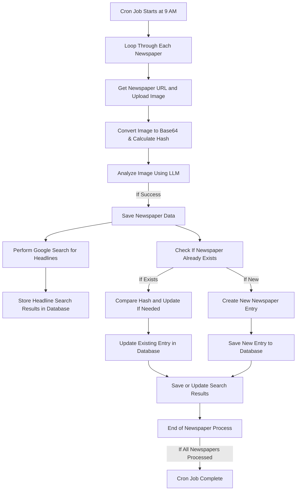

Frontpages is a simple web app that collects the front pages of popular newspapers in Nigeria, extracts the headlines, and cites articles and sources discussing those headlines. It’s designed to make it easier for you to stay informed without the hassle of jumping between multiple news sites.

#### Built With:

- **Hono** - server
- **MongoDB** - database
- **Mongoose** - ORM for database interaction

Using Hono was a refreshing experience compared to Express, which I was already familiar with. I loved the straightforward context object that houses the request and response objects, along with handy shortcuts like `ctx.json(responseObject)` to send responses.

Here’s a quick comparison of syntax:
 
 ```js
// express syntax
app.get("/", (req, res) => {
	const someParam = c.req.param("someParam")
	return res.json({"foo": "bar"})
})


// hono syntax
app.get("/", async(c) => {
	const someParam = c.req.params.someParam")
	return c.json({"foo": "bar"})
})
 
```

I also think using middleware in Hono is syntactically cleaner!

#### A Peek Behind the Scenes

Here’s a simple flowchart illustrating the logic that goes on under the hood:

For the LLM function, I initially thought about using ChatGPT because it outputs JSON directly. Unfortunately, I couldn't go that route due to the steep costs of the API. Instead, I opted for Google Gemini Flash, which is free—thank you, Google! The trade-off in this use case is that it doesn’t provide a direct JSON output. While Google allows you to define a schema for the response, the output still comes as plain text, requiring some extra parsing. Although the responses have been consistent, it still feels a bit off.

Here’s an example of how I set up the response schema:
```js
import { GoogleGenerativeAI, SchemaType } from "@google/generative-ai";


const genAI = new GoogleGenerativeAI(process.env.GEMINI_API_KEY);
const schema = {
  description: "api response",
  type: SchemaType.OBJECT,
    properties: {
      success: {
        type: SchemaType.BOOLEAN,
        description: "Success of prompt in parsing input image.",
        nullable: false
      },
      result: {
        type: SchemaType.ARRAY,
        items: {
          type: SchemaType.OBJECT,
          properties: {
            headline:{
              type: SchemaType.STRING,
              description: "Headline as extracted in image.",
              nullable: false,
            },
            search_query: {
              type: SchemaType.STRING,
              description: "search query to use with google search api to get related news article.",
              nullable: false,
            },
            tag:{
              type: SchemaType.ARRAY,
              items: {
                type: SchemaType.STRING,
                description: "Tags to select from as supplied in prompt.",
                nullable: false
              },
              nullable: false,
            },
          }
        },
        nullable: true
      },
      error: {
        type: SchemaType.STRING,
        description: "Error message as supplied in prompt.",
        nullable: true
      }

    }
  }
const model = genAI.getGenerativeModel({ model: "gemini-1.5-flash" , generationConfig: {
  responseMimeType: "application/json",
  responseSchema: schema,
}
}, );
// ... unneccessary code ...
  const result = await model.generateContent([prompt,
        {
      inlineData:{
        mimeType: "image/png",
        data: dataUrlString
      }
    },
  ]);
  const response = cleanResponse(await JSON.parse(result.response.text()))
  return response
  // ... more unneccessary code ...
  
```

For fetching related articles citing specific headlines, I rely on Google Custom Search. However, there’s a limit of 100 queries per day, so I have to manage my requests carefully.

### Future Improvements

While I’m thrilled with how Frontpages has turned out so far, there are always opportunities for improvement! Here are a few ideas I’m considering:

1. **Enhanced User Interface**: Making the app more visually appealing and user-friendly to improve the overall experience.
2. **Real-time Updates**: Implementing WebSocket support to provide users with real-time updates on news headlines.
3. **Personalized News Feeds**: Allowing users to customize their news feeds based on their interests or preferred sources.
4. **Offline Access**: Adding a feature to allow users to save articles for offline reading.
5. **AI-Powered Summaries**: Leveraging AI to generate concise summaries of the headlines for quicker consumption.

I’m excited about the journey ahead and can’t wait to see how Frontpages evolves. Stay tuned for more updates!