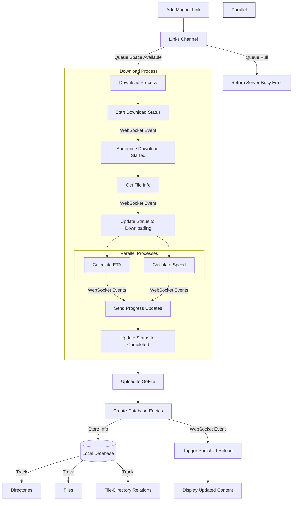

As many of you know, I recently started learning Go. After spending a lot of time reading documentation, books, and articles as well as binge-watching tutorial videos, I felt it was time to put my newly acquired knowledge into practice.

One service that has always intrigued me is **[Seedr.cc](https://seedr.cc)**. Seedr is a web service that allows users to download torrents by first adding them via a torrent file or magnet link, the service in turn downloads it and eventually provides a download link that allows downloading the added resource over HTTPS. Coming from a country where internet is both expensive and slow, I often find myself needing Seedr for certain downloads. However, while Seedr is a fantastic service, it isn't entirely free. It has a generous freemium plan, but with limitations: each individual torrent cannot exceed 2GB, and downloads may be terminated if they aren’t completed within a certain time frame. These restrictions, while understandable, made the service less useful for my needs.

## Why Go?

I do a lot of hosting on a VPS with **4GB RAM and 50GB storage** a service that was provisioned at an exclusive discount by **[Boyemma](https://www.webytely.com)**. Given my experience running Node.js applications, I knew that considering my limited resources, building this in **TypeScript** would be a bad idea. My VPS already hosts about five web projects, two databases, and the **Coolify** instance handling Dockerization of the whole setup.

Go, on the other hand, offered significant advantages:
- **Low memory footprint**
- **Strong static typing**
- **Built-in concurrency via goroutines**
- **A great opportunity to work on a decently sized project and learn more about Go’s ecosystem**

This project was the perfect way to dive deeper into Go, especially in structuring projects, understanding embedding and composition, and tackling real-world problems with concurrency.

## The Initial Struggles

The beginning was overwhelming. I wasn’t sure how to start, and it seemed like there were no necessarily strong "official" opinions on project structuring. Considering the chance of encountering cyclic dependency import problems and the new folder-like package structure Go exposed me to, this led to **days of procrastination**. During my research, I stumbled upon the **[Melkey's Go Blueprint](https://docs.go-blueprint.dev/)** and a Reddit thread discussing this exact problem. While I didn’t end up using the blueprint, it gave me valuable insights into structuring my code.

However, my biggest realization came later as I didn’t fully understand how my app would work **code-wise**. I knew what I wanted to build, but when I started brainstorming the actual implementation, I saw gaps in my understanding. This is something I’ve noticed in many of my past projects: **things seem clear in my head, but when I try to write them down, the gaps become obvious.** Going forward, **before writing any code, I will always start with a solid plan on paper.**

## Defining the MVP

I had **too many ideas**, which quickly became overwhelming (and, if I’m being honest,made me a little miserable). Eventually, I forced myself to focus on **the bare minimum necessary to get the app working**. Once I had that, I could add features to improve the experience. This shift in mindset helped me move forward.

During the planning stage, I realized I needed a **frontend** and also had to tackle several architectural decisions. Here are some of the key considerations and their solutions:

| Question | Decision |
|----------|----------|
| How many downloads can run simultaneously? | Only one at a time, but up to 50 can be queued. |
| What happens when storage runs out? | Check available space before downloading. If storage is insufficient, notify the user. |
| How will files be stored temporarily? | Use **GoFile**, a free file hosting service while use a local database to keep track of what is available(API was limited for non-premium users) |

## Tackling File Storage Without Extra Costs

Since I’m **cheap**, I wanted this to run **without any additional costs**. That meant finding a **free** service to store files temporarily. After some searching, I found **[GoFile](https://gofile.io)**. While its free tier has some restrictions, they aren’t an issue unless scaling is needed. To better integrate GoFile into my project, I created a **custom API wrapper** in Go.

This side project introduced me to **semantic versioning (SemVer)** and **publishing a package on pkg.go.dev**. It also made me appreciate **Go Doc** and inline code documentation. You can find the published package here:
[github.com/plutack/go-gofile](https://pkg.go.dev/github.com/plutack/go-gofile)

## Backend First, Frontend Later

I started with **backend-only development**, using a **command-line interface (CLI)** to trigger torrent downloads and test the overall flow. Later, when I began thinking about the frontend, I introduced **WebSockets** to provide real-time updates.

Here’s a high-level flowchart of how the system works:

## What’s Next?

In my next blog post, I’ll dive deeper into the frontend implementation, my decision to use raw SQL instead of an ORM, the WebSocket implementation, and additional features I plan to build.

Stay tuned!

## Links to Resources
 - [https://github.com/Melkeydev/go-blueprint](https://github.com/Melkeydev/go-blueprint)
 - [Reddit post on structuring go code](https://www.reddit.com/r/golang/comments/qwyk3k/what_is_the_best_way_to_organize_code_within_a_go/)
 - [Seedrlike Repo](https://github.com/plutack/seedrlike)
